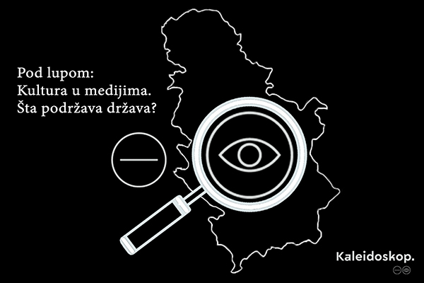

 <script src="https://cdn.plot.ly/plotly-latest.min.js"></script>

<style>
body{ /* Normal  */
      font-size: 12px;
  }
td {  /* Table  */
  font-size: 12px;
}
p {
    color: #231f20;
    font-family: 'Libre Baskerville', serif;
}
h1.title {
  font-size: 38px;
  color: #231f20;
  font-weight: 700;
  text-transform: none;
}
h1 { /* Header 1 */
  font-size: 28px;
  color: #231f20;
  font-family: 'Libre Baskerville', serif;
  font-weight: 700;
  text-transform: uppercase;
}
h2 { /* Header 2 */
    margin-top: 40px;
    font-size: 22px;
  color: #231f20;
  font-family: 'Libre Baskerville', serif;
  font-weight: 700;
      border-bottom: 1px solid #231f20;
    margin-bottom: 20px;
    text-transform: uppercase;
}
h3 { /* Header 3 */
    margin-top: 40px;
  font-size: 18px;
  font-family: 'Libre Baskerville', serif;
  color: #231f20;
  font-weight: 700;
      border-bottom: 1px solid #231f20;
    margin-bottom: 20px;
    text-transform: uppercase;
}

h3.subtitle { /* Header 3 */
    margin-top: 40px;
  font-size: 18px;
  font-family: 'Libre Baskerville', serif;
  color: #231f20;
  font-weight: 700;
      border-bottom: 0px solid #231f20;
    margin-bottom: 0px;
    text-transform: none;
}


h4.author {
  margin-top: 5px;
  font-size: 14px;
  font-family: 'Libre Baskerville', serif;
  color: #231f20;
      border-bottom: 0px solid #231f20;
    margin-bottom: 0px;
    text-transform: none;
}
h4.date {
  margin-top: 5px;
  font-size: 14px;
  font-family: 'Libre Baskerville', serif;
  color: #231f20;
        border-bottom: 0px solid #231f20;
    margin-bottom: 10px;
    text-transform: none;
}
h4 {
  margin-top: 40px;
  font-size: 16px;
  font-family: 'Libre Baskerville', serif;
  color: #231f20;
  font-weight: 700;
      border-bottom: 1px solid #231f20;
    margin-bottom: 20px;
    text-transform: uppercase;
}
code.r{ /* Code block */
    font-size: 12px;
    font-family: 'Libre Baskerville', serif;
}
pre { /* Code block - determines code spacing between lines */
    font-size: 14px;
    font-family: 'Libre Baskerville', serif;
}
</style>


```{r pressure, echo=FALSE, fig.retina = 2, out.width = '30%'}

```


```{r setup, include=FALSE}
knitr::opts_chunk$set(echo = TRUE)
#Ukoliko nemate prethodno instalirane pakete obrisite tarabu u narednim redovima i instalirajte ih
#install.packages("tidyverse")
#install.packages("readxl")
#install.packages("plotly")
#install.packages("scales")
#install.packages("viridis")
#install.packages("lubridate")
#install.packages("writexl")
#install.packages("stringi")
#install.packages("crosstalk")
#Instaliranje paketa se radi samo prvi put kada se koriste, a da bi im se pristupilo koristi se funkcija library
library(tidyverse)
library(readxl)
library(plotly)
library(scales)
library(viridis)
library(crosstalk)
library(lubridate)
library(writexl)
library(stringi)
library(gapminder)
library(gt)
library(DT)
library(rsconnect)
library(ggplot2)
library(tidyr)
library(crosstalk)
library(RColorBrewer)
library(bookdown)
# load equatiomatic
library(equatiomatic)
library(htmltools)

```


```{r podaci, echo=FALSE}
# ucitavanje excel tabele
options(scipen = 999)

# rsconnect::setAccountInfo(name='duskomedic',
# 			  token='40579C632AB265ED6920190F1E729A99',
# 			  secret='0B59fVd4k7+R1z+aRq2Lx7tMywqLho/TJxJTi0dD')

Projektkultura <- read_excel("Projektno-sufinansiranje.xlsx",  col_types = "text")

Projektkultura$`EVRI` <- as.numeric(as.character(Projektkultura$`EVRI`))  # Convert one variable to numeric
Projektkultura$`DINARI` <- as.numeric(as.character(Projektkultura$`DINARI`))  # Convert one variable to numeric


Projektkultura <- filter(Projektkultura, ORGAN == 'Pokrajinski sekretarijat za kulturu i javno informisanje')
```

<br>
Cilj projekta [“Pod lupom: Kultura u medijima – Šta podržava država?”](https://kaleidoskop-media.com/mediji/nepodnosljiva-lakoca-pustosenja-budzeta) Kulturnog centra Kaleidoskop predstavlja detaljnu analizu medijskih projekata u kulturi (2015-2022) koji su sufinansirani na svim nivoima vlasti u Republici Srbiji, odnosno iz budžeta Ministarstva kulture i informisanja, Pokrajinskog sekretarijata za kulturu i informisanje i 132 lokalne samouprave.<br><br>
Srbija za svoju kulturu izdvaja najmanje po glavi stanovnika u regionu i već godinama je taj trend manji od jedan odsto (u 2022. godini izdvojeno 0,87 odsto od ukupnog državnog budžeta). U taj procenat ulaze i sufinansirani medijski projekti koji su predmet ove analize.
Istraživanje koje je pred vama, analizira rezultate javnih medijskih konkursa realizovanih u periodu 2015. godine do kraja juna 2022. godine, tj. odobrene projekte na ovim konkursima čiji je cilj bio podizanje informisanosti građana Srbije u oblasti kulture. Analiza će nam pomoći da jasnije sagledamo sliku šta u kulturi država podržava i koji su to medijski sadržaji za koje se izdvajaju sredstva.<br><br>
Dosadašnjom analizom naših novinara istraživača nameće se zaključak da sadržaji podržanih medijskih projekata iz kulture imaju trend “opštih mesta”: finansira se redovan sadržaj medija, projekti ne sadrže inovativne modele, često su neusklađeni sa posebnim kriterijumima nevedenim u Konkursu. Mnogi podržani projekti su nevidljivi na internetu, finansijsku podršku dobijaju portali koji čak nemaju rubriku Kultura, a nejasno je gde produkcije emituju sadržaj. Tako dolazimo do apsurda da radnici u kulturi u Srbiji imaju teškoće da svoj rad predstave javnosti, jer se rubrike kulture gase, smanjuje se broj novinara koji prate ovaj sektor, forsira se estrada… A sa druge strane, novac za medijsko praćenje kulture se razliva u sumnjive kanale, copy-paste tekstove sa sadržajima viđenim na desetine puta.<br><br>
Analizom svih ovih sadržaja želimo da ukažemo na navedene nedostatke i obavestimo javnost, kako bi se pokrenula debata i podigla svest o tome šta su relevantni kulturni sadržaji.<br><br>
U nastavku donosimo detaljnu statističku analizu projekata koje je podržao Pokrajinski sekretarijat za kulturu i javno informisanje.<br>


## ANALIZA MEDIJSKIH PROJEKATA U KULTURI (2015-2022) - POKRAJINSKI SEKRETARIJAT ZA KULTURU I JAVNO INFORMISANJE

```{r Ukupan broj i suma projekata po organu i godinama, echo=FALSE}
#Ukupan broj projekata
brojprojekata <- Projektkultura
brojprojekata$Podoblast <- brojprojekata$Podoblast %>% replace_na('Nejasno')
brojpr <- nrow(brojprojekata)

# Broj projekata prema godinama
brojprgodina <- brojprojekata %>%
  group_by(`GODINA`) %>%
    summarise(`BROJ PROJEKATA` = n()) %>%
  mutate()


# Suma svih projekata u evrima
sumaprojekataevri <- brojprojekata %>%
    summarise(`EVRI` = sum(`EVRI`)) %>%
  mutate()

ukupnasuma <- sumaprojekataevri$`EVRI`

sumaprojekataevri$`EVRI` <- format(sumaprojekataevri$`EVRI`, big.mark=',', digits = 0, nsmall=0, scientific = FALSE)

# Suma svih projekata u evrima po godinama
sumaprojekataevrigodina <- brojprojekata %>%
  group_by(GODINA) %>%
    summarise(`EVRI` = sum(`EVRI`)) %>%
  mutate()

# sumaprojekataevrigodina$`EVRI` <- format(sumaprojekataevrigodina$`EVRI`, big.mark=',', digits = 0, nsmall=0, scientific = FALSE)

# Suma svih projekata u dinarima
sumaprojekatadinari <- brojprojekata %>%
   summarise(`DINARI` = sum(`DINARI`)) %>%
  mutate()

sumaprojekatadinari$`DINARI` <- format(sumaprojekatadinari$`DINARI`, big.mark=',', digits = 0, nsmall=0, scientific = FALSE)


# Suma svih projekata u dinarima po godinama
sumaprojekatadinarigodina <- brojprojekata %>%
  group_by(GODINA) %>%
    summarise(`DINARI` = sum(`DINARI`)) %>%
  mutate()

#sumaprojekatadinarigodina$`DINARI` <- format(sumaprojekatadinarigodina$`DINARI`, big.mark=',', digits = 0, nsmall=0, scientific = FALSE)

# Broj projekata prema organu koji je raspisao konkurs za grafikon
brojprojekataorgan <- brojprojekata %>%
  group_by(`ORGAN`) %>%
    summarise(`BROJ PROJEKATA` = n()) %>%
  mutate()

# broj organa koje je raspiso konkurs
brojorgana <- n_distinct (brojprojekataorgan$`ORGAN`)

#Podskup za kolicinu novca po Organima
novacgodorgan <- brojprojekata %>%
    group_by(ORGAN) %>%
  summarise(`EVRI` = sum(`EVRI`)) %>%
  mutate()

novacgodorgan$`EVRI` <- format(novacgodorgan$`EVRI`, big.mark=',', digits = 0, nsmall=0, scientific = FALSE)


#Podskup za kolicinu novca koja je ukupno data po godinama za tabelu
novacgod <- brojprojekata %>%
    group_by(GODINA) %>%
  summarise(`EVRI` = sum(`EVRI`)) %>%
  mutate()

novacgod$`EVRI` <- format(novacgod$`EVRI`, big.mark=',', digits = 0, nsmall=0, scientific = FALSE)

#Spajanje podataka
ORGAN = merge(x = brojprojekataorgan, y = novacgodorgan, by = "ORGAN", all.x = TRUE)

```

U periodu od 2015. godine do kraja juna 2022. godine na javnim konkursima sufinansiranja javnog interesa u sferi javnog informisanja Pokrajinski sekretarijat za kulturu i javno informisanje ukupno je odobrio <b>`r sumaprojekatadinari` dinara</b> ili <b>`r sumaprojekataevri`  evra</b> za medijske projekte namenjene javnom informisanju u oblasti kulture.  U posmatranom periodu, ukupno je odobreno <b>`r brojpr` relevatnih projekata</b>. <br>


<br>
Ukupna izdvajanja za medijske projekte koji se bave kulturom po godinama možete videti na grafikonu dole.<br>
<br>

```{r echo=FALSE}

sumaprojekatadinari1 <- sum(as.numeric(sumaprojekatadinarigodina$DINARI), na.rm = TRUE)  # Suma dinari
sumaprojekataevri1 <- sum(as.numeric(sumaprojekataevrigodina$EVRI), na.rm = TRUE)  # Suma evri
prosecnavrednostevri <- sumaprojekataevri1/brojpr
prosecnavrednostdinari <- sumaprojekatadinari1/brojpr

prosecnavrednostevri <- round(prosecnavrednostevri, digits = 2)   
prosecnavrednostdinari <- round(prosecnavrednostdinari, digits = 2)  

prosecnavrednostevri <- format(prosecnavrednostevri, big.mark=',', digits = 0, nsmall=0, scientific = FALSE)
prosecnavrednostdinari <- format(prosecnavrednostdinari, big.mark=',', digits = 0, nsmall=0, scientific = FALSE)

medijanavrednostievri <- median(as.numeric(Projektkultura$EVRI))
medijanavrednostidinari <- median(as.numeric(Projektkultura$DINARI))

medijanavrednostievri <- format(medijanavrednostievri, big.mark=',', digits = 0, nsmall=0, scientific = FALSE)
medijanavrednostidinari <- format(medijanavrednostidinari, big.mark=',', digits = 0, nsmall=0, scientific = FALSE)


# Plot
dataLINE1 <- data.frame(sumaprojekataevrigodina$`GODINA`, sumaprojekataevrigodina$`EVRI`)


dataLINE1$sumaprojekataevrigodina.EVRI <- format(dataLINE1$sumaprojekataevrigodina.EVRI, big.mark=',', digits = 0, nsmall=0, scientific = FALSE)


ggplot(dataLINE1) + 
  geom_point(aes(x = sumaprojekataevrigodina.GODINA, y = sumaprojekataevrigodina.EVRI, group=1 ))+
  geom_line(aes(x = sumaprojekataevrigodina.GODINA, y = sumaprojekataevrigodina.EVRI, group=1 )) + 
  xlab("GODINA")+ ylab("EVRI")+
  ggtitle("Medijski projekti u oblasti kulture (2015 - jun 2022); Pokrajina") +
   geom_label( aes(x = sumaprojekataevrigodina.GODINA, y = sumaprojekataevrigodina.EVRI,  label = sumaprojekataevrigodina.EVRI) )

# fig <- plot_ly() 
# 
# fig <- fig %>%
#   add_trace(
#     type = 'scatter',
#     mode = 'lines+markers',
#     x = sumaprojekataevrigodina$`GODINA`,
#     y =sumaprojekataevrigodina$`EVRI`,
#     hovertemplate = 'Ukupno: %{y:$.0f}<extra></extra>',
#     showlegend = FALSE
#   ) %>%
#    layout(title = 'Medijski projekti u oblasti kulture (2015-2020) - Pokrajina', plot_bgcolor = "#e5ecf6", xaxis = list(title = 'Godina'), yaxis = list(title = 'Ukupno u evrima'))
# 
# 
# fig

```


Prosečna vrednost medijskih projekata u oblasti kulture u posmatranom periodu iznosi <b>`r prosecnavrednostdinari` dinara</b> ili <b>`r prosecnavrednostevri` evra</b>. S obzirom da prosečnu vrednost čini i velik broj onih projekata koji daleko prevazilazi srednju vrednost, o samoj vrednosti projekta u posmatranom periodu više govori medijana ili srednja vrednost projekata koja deli sve vrednosti projekata na dva dela iznad i ispod vrednosti medijane, koja je u posmatranom periodu iznosi <b>`r medijanavrednostidinari` dinara</b> ili <b>`r medijanavrednostievri` evra</b>.
<br>

Ukupan broj realizovanih projekata po godinama možete vidite na grafikonu dole.<br><br>


```{r echo=FALSE}


# Plot
dataLINE2 <- data.frame(GODINA=brojprgodina$`GODINA`, BROJ=brojprgodina$`BROJ PROJEKATA`)


#dataLINE2$sumaprojekataevrigodina.EVRI <- format(dataLINE2$sumaprojekataevrigodina.EVRI, big.mark=',', digits = 0, nsmall=0, scientific = FALSE)


ggplot(dataLINE2) + 
  geom_point(aes(x = GODINA, y = BROJ, group=1 ))+
  geom_line(aes(x = GODINA, y = BROJ, group=1 )) + 
  xlab("GODINA")+ ylab("UKUPAN BROJ PROJEKATA")+
  ggtitle("Broj medijskih projekata po godinama (2015 - jun 2022); Pokrajina") +
   geom_label( aes(x = GODINA, y = BROJ,  label = BROJ) )


# figod <- plot_ly() 
# 
# figod <- figod %>%
#   add_trace(
#     type = 'scatter',
#     mode = 'lines+markers',
#     x = brojprgodina$`GODINA`,
#     y = brojprgodina$`BROJ PROJEKATA`,
#     hovertemplate = 'Ukupno: %{y:.0f}<extra></extra>',
#     showlegend = FALSE
#   ) %>%
#    layout(title = 'Broj medijskih projekata namenjenih informisanju u oblasti kulture po godinama - Pokrajina', plot_bgcolor = "#e5ecf6", xaxis = list(title = 'Godina'), yaxis = list(title = 'Broj projekata'))
# 
# figod

```


#### PODNOSIOCI PROJEKATA

Pogledajmo sada sumu odobrenih novaca i broj projekata po podnosiocima medijskih projekata čiji je cilj bio podizanje informisanosti građana u oblasti kulture. Podnosioci projekata su sva ona preduzeća, agencije, organizacije koji su bili nosioci projekata. U pojedinim slučajevima podnosilac projekta predstavlja instituciju poput fakulteta ili religijske organizacije koja nije registrovana u APR-u. U takvim slučajevima, imena podnosilaca preuzimana su iz rešenja samih konkursa, a u svim ostalim, imena su usklađena za nazivima u APR-u.


```{r Ukupan broj podnosilaca, echo=FALSE}
#Ukupan broj podnosilaca
brojpodnosilaca <- n_distinct (brojprojekata$`PODNOSILAC`)

# Broj projekata prema podnosiocima
brojprpodnosioci <- brojprojekata %>%
  group_by(`PODNOSILAC`) %>%
    summarise(`BROJ PROJEKATA` = n()) %>%
  mutate()

#Podskup za kolicinu novca koja je ukupno data po podnosiocima za tabelu
novacgodpodnosioci <- brojprojekata %>%
    group_by(PODNOSILAC) %>%
  summarise(`EVRI` = sum(`EVRI`)) %>%
  mutate()

novacgodpodnosioci$`EVRI` <- format(novacgodpodnosioci$`EVRI`, big.mark=',', digits = 0, nsmall=0, scientific = FALSE)

#Spajanje podataka
PODNOSILAC = merge(x = brojprpodnosioci, y = novacgodpodnosioci, by = "PODNOSILAC", all.x = TRUE)


TopPODNOSILAC <- PODNOSILAC %>%      # Top N highest values by group
  arrange(desc(EVRI)) 
  #group_by( 'EVRI') %>%
  

Toppod <- TopPODNOSILAC[1,1] 
Topevri <- TopPODNOSILAC[1,3] 


TopPODNOSILACpr <- PODNOSILAC %>%      # Top N highest values by group
  arrange(desc(`BROJ PROJEKATA`)) %>% 
  #group_by( 'EVRI') %>%
  slice(1:3)

Toppodpr <- TopPODNOSILACpr[1,1] 
Toppodprbroj <- TopPODNOSILACpr[1,2]
Topevripr <- TopPODNOSILACpr[1,3] 

```

<b>Ukupno (`r brojpr`) medijskih projekata</b> namenjenih informisanju u kulturi, realizavalo je, od 2015. godine do 30. juna 2022. godine, <b>`r brojpodnosilaca` različitih podnosioca projekata</b>. 
<br>
<br>
Najveći broj sredstava u posmatranom periodu, <b>ukupno `r Topevri` evra</b>, odobreno je podnosiocu <b>`r Toppod`</b>. Sa druge strane, najveći broj projekata u posmatranom periodu (<b>ukupno `r Toppodprbroj` projekata</b>),dodeljeno je podnosiocu <b>`r Toppodpr`</b>, i to u ukupnom iznosu od <b>`r Topevripr` evra</b>. 
<br>
<br>
<p style="color:red;">VAŽNO: sve tabele su interaktivne. Možete ih pretraživati - tražiti maksimalne i minimalne vrednosti. Potrebno je da vrednosti po kolonama sortirate po ikonicama na kojim stoje strelica na gore i strelica na dole. <p> 

<br>

```{r echo=FALSE}

datatable(TopPODNOSILAC, caption = 'Tabela 2: Ukupan broj relevantnih projekata i njihova suma u evrima prema podnosiocu projekta (2015-2022)', options = list(pageLength = 5))

```


#### MEDIJI KOJI SU REALIZOVALI PROJEKTE

Svakako je zanimljivo videti i ukupnu suma odobrenih sredstava i broj projekata po medijima na kojima su objavljivani medijski sadržaji čiji je cilj bio podizanje informisanosti građana u oblasti kulture. Ovde treba napomenuti da mediji nemaju svojstvo pravnog lica, već to ima njihov osnivač (podnosilac projekta) i da u velikom broju slučajeva, podnosioci projekta nemaju svoje registrovane medije, već su to onda u pitanju produkcije, za koje, iz rešenja medijskih konkursa još uvek se ne može jasno utvrditi na kojim medijima su producirani nastali medijski sadržaji. Isto tako, u velikom broju rešenja za medijske konkurse nije moguće utvrditi medij na kojem su sadržaji emitovani, ukoliko podnosilac projekta ima više medija, i ukoliko u konkursnom rešenju nije navedeno na kojem konkretno mediju je realizovan medijski sadržaj.

```{r Ukupan broj medija, echo=FALSE}
#Ukupan broj medija
brojmedija <- n_distinct (brojprojekata$`MEDIJ`)


Projectmedia1 <- brojprojekata %>%
    filter(`MEDIJ` != 'Produkcija')

# Broj projekata prema podnosiocima
brojprmediji <- Projectmedia1 %>%
  group_by(`MEDIJ`) %>%
    summarise(`BROJ PROJEKATA` = n()) %>%
  mutate()

#Podskup za kolicinu novca koja je ukupno data po mediju za tabelu
novacgodmediji <- Projectmedia1 %>%
    group_by(MEDIJ) %>%
  summarise(`EVRI` = sum(`EVRI`)) %>%
  mutate()

novacgodmediji$`EVRI` <- format(novacgodmediji$`EVRI`, big.mark=',', digits = 0, nsmall=0, scientific = FALSE)

#Spajanje podataka
MEDIJ = merge(x = brojprmediji, y = novacgodmediji, by = "MEDIJ", all.x = TRUE)


TopPODNOSILAC <- MEDIJ %>%      # Top N highest values by group
  arrange(desc(EVRI)) 
  #group_by( 'EVRI') %>%


Toppod <- TopPODNOSILAC[1,1] 
Topevri <- TopPODNOSILAC[1,3] 


TopPODNOSILACpr <- MEDIJ %>%      # Top N highest values by group
  arrange(desc(`BROJ PROJEKATA`)) %>% 
  #group_by( 'EVRI') %>%
  slice(1:3)

Toppodpr <- TopPODNOSILACpr[1,1] 
Toppodprbroj <- TopPODNOSILACpr[1,2]
Topevripr <- TopPODNOSILACpr[1,3] 

```


<b>Ukupno (`r brojpr`) medijskih projekata</b> namenjenih informisanju u kulturu, realizavalo je, od 2015. do 30. juna 2022. godine, <b>`r brojmedija-2` različitih medija</b> dok su ostali medijski projekti nastali u različitim produkcijama.
<br>
<br>
Najveći broj sredstava u posmatranom periodu, <b>ukupno `r Topevri` evra</b>, odobreno je mediju - <b>`r Toppod`</b>. Sa druge strane, najveći broj projekata u posmatranom periodu (<b>ukupno `r Toppodprbroj` projekata</b>), dodeljeno je mediju <b>`r Toppodpr`</b>, i to u ukupnom iznosu od <b>`r Topevripr` evra</b>. 
<br>

```{r echo=FALSE}
datatable(TopPODNOSILAC, caption = 'Tabela 3: Suma odobrenih sredstava i broj projekata po medijima - od 2015 do 30. juna 2022. godine.', options = list(pageLength = 5))

```

#### PRODUKCIJE KOJE SU REALIZOVALE PROJEKTE


```{r produkcije, echo=FALSE}

Brojprodukcija <- brojprojekata %>%
    filter(`MEDIJ` == 'Produkcija')

Brojjedinstvenihprodukcija <- n_distinct (Brojprodukcija$`PODNOSILAC`)

# Broj projekata prema produkciji
brojprprodukcija1 <- Brojprodukcija %>%
  group_by(`PODNOSILAC`) %>%
    summarise(`BROJ PROJEKATA` = n()) %>%
  mutate()

#Podskup za kolicinu novca koja je ukupno data po produkciju za tabelu
novacgodprodukcija <- Brojprodukcija %>%
    group_by(PODNOSILAC) %>%
  summarise(`EVRI` = sum(`EVRI`)) %>%
  mutate()

novacgodprodukcija$`EVRI` <- format(novacgodprodukcija$`EVRI`, big.mark=',', digits = 0, nsmall=0, scientific = FALSE)

#Spajanje podataka
PRODUKCIJA = merge(x = brojprprodukcija1, y = novacgodprodukcija, by = "PODNOSILAC", all.x = TRUE)


TopPODNOSILAC <- PRODUKCIJA %>%      # Top N highest values by group
  arrange(desc(EVRI))
  #group_by( 'EVRI') %>%


Toppod <- TopPODNOSILAC[1,1] 
Topevri <- TopPODNOSILAC[1,3] 


TopPODNOSILACpr <- PRODUKCIJA %>%      # Top N highest values by group
  arrange(desc(`BROJ PROJEKATA`)) %>% 
  #group_by( 'EVRI') %>%
  slice(1:3)

Toppodpr <- TopPODNOSILACpr[1,1] 
Toppodprbroj <- TopPODNOSILACpr[1,2]
Topevripr <- TopPODNOSILACpr[1,3] 

```
Ukupno <b>`r Brojjedinstvenihprodukcija` produkcijskih kuća</b> je sprovodilo medijske projekte čiji je cilj bio podizanje informisanosti građana u oblasti kulture. Iako smo nedostajuće podatke iz rešenja medijskih konkursa dodatno proveravali u "Registru medija", ovde treba voditi računa da u slučajevima kada u rešenjima nije navedeno ime medija i kada nije bilo podataka u registru, podnosioce projekata koje imaju registrovane medije, navodili smo kao produkciju.
<br>
<br>
Najveći broj sredstava u posmatranom periodu, <b>ukupno `r Topevri` evra</b>, odobreno je produkciji - <b>`r Toppod`</b>. Sa druge strane, najveći broj projekata u posmatranom periodu (<b>ukupno `r Toppodprbroj` projekata</b>), dodeljeno je produkciji <b>`r Toppodpr`</b>, i to u ukupnom iznosu od <b>`r Topevripr` evra</b>. 
<br>

```{r echo=FALSE}
datatable(TopPODNOSILAC, caption = 'Tabela 4: Ukupan broj produkcija i suma u evrima koja im je dodeljena u periodu 2015 - 30.jun 2022. godine', options = list(pageLength = 5))

```
<br>

## PROJEKTI PO OBLASTIMA I PODOBLASTIMA


```{r teme, echo=FALSE}
# Broj projekata prema temi
brojprtema <- brojprojekata %>%
  group_by(`Oblast`) %>%
    summarise(`BROJ PROJEKATA` = n()) %>%
  mutate()

#Podskup za kolicinu novca koja je ukupno data po temama za tabelu
novacgodtema <- brojprojekata %>%
    group_by(Oblast) %>%
  summarise(`EVRI` = sum(`EVRI`)) %>%
  mutate()

novacgodtema$`EVRI` <- format(novacgodtema$`EVRI`, big.mark=',', digits = 0, nsmall=0, scientific = FALSE)

#Spajanje podataka
TEMA = merge(x = brojprtema, y = novacgodtema, by = "Oblast", all.x = TRUE)


sumaprojekataoblast <- sum(as.numeric(brojprtema$`BROJ PROJEKATA`), na.rm = TRUE)  # Suma evri

```

S obzirom da se kultura odnosi na celokupno društveno nasleđe neke grupe ljudi, to jest na nučene obrasce mišljenja, osećanja i delovanja neke grupe, zajednice ili društva, kao i na izraze tih obrazaca u materijalnim objektima, pregled sufinansiranih medijskih konkursa i sadržaja čiji je cilj bio informisanje građana u oblasti kulture u periodu od osam godina koje smo sufinansirali javnim sredstvima u Srbiji, dosta će nam reči o stanju u kulturi, našim interesovanjima i vrednostima. 
<br>
Da bi smo sagledali ta interesovanja, naši istraživači kodirali su medijske projekte namenjene proizvodnji medijskih sadržaja u kulturi na sledećih devet oblasti: Aktuelna kulturna produkcija, Društvo, Filmsko stvaralaštvo, Kulturna baština, Manifestacije, Multikulturalnost, Muzika, Obrazovanje, i Vizuelno stvaralaštvo. 

Početna baza našeg istraživanja bila je otvorena baza podataka <b>"Projektno sufinansiranje medija u Srbiji"</b> [“Centra za održive zajednice”](https://odrzivezajednice.org/). Baza sadrži, velik broj informacija o rezultatima javnih medijskih konkursa realizovanih u periodu od osam godina, na svim nivoima vlasti u Srbiji. Istraživači su imali zadatak da pregledaju preko 2480 relevantnih projekata iz baze od ukupno 16,590 realizovanih projekata (oko 15 odsto "projekata u kulturi"). 

Oblasti i podoblasti projekata kodirani su po nazivima projekata, u slučajevima ukoliko su oni navođeni u konkursnim rešenjima, kodirani su kao  
Nedefinisani. Određeni broj naziva projekata koji ne potpadaju ni pod jednu od navedenih oblasti ili podoblasti zavedeni su pod – Ostalo. Jasno je da ovo nije savršen metodološki pristup, ali nam on može dati indikaciju kulturnih oblasti, i ukaže nam određene trendove. Nadamo se da će ovaj deo naših rezultata projekta omogućiti istraživačima lakši rad na dubljim i specifičnijim analizama konkursnog sufinansiranja medijskih sadržaja u kulturi.

Kao što smo već istakli, u posmatranom uzorku medijskih projekata, <b>POKRAJINSKI SEKRETARIJAT ZA KULTURU I INFORMISANJE</b> odobrio je  <b>ukupno `r sumaprojekataoblast` projekata čiji je cilj bio informisanje u kulturi</b>. Ukupna suma odobrena, <b>`r sumaprojekataevri`  evra</b>, odobrena je u periodu od 2015. do 30. juna 2022. godine.


```{r jezici, echo=FALSE}
#Iskuljucivanje praznih polja
Brojjezik <- brojprojekata


Brojjezikcisto <- Brojjezik %>%
   filter(!is.na(Brojjezik$`Oblast`))


# Broj projekata prema jeziku
brojprjezici <- Brojjezikcisto %>%
  group_by(`Oblast`) %>%
    summarise(`BROJ PROJEKATA` = n()) %>%
  mutate()

#Podskup za kolicinu novca koja je ukupno data po jezicima za tabelu
novacgodjezici <- Brojjezikcisto %>%
    group_by(Oblast) %>%
  summarise(`EVRI` = sum(`EVRI`)) %>%
  mutate()

novacgodjezici$`EVRI` <- format(novacgodjezici$`EVRI`, big.mark=',', digits = 0, nsmall=0, scientific = FALSE)

#Spajanje podataka
OBLASTI = merge(x = brojprjezici, y = novacgodjezici, by = "Oblast", all.x = TRUE)


options(dplyr.summarise.inform = FALSE)


TopOBLASTIpr <- OBLASTI %>%      # Top N highest values by group
  arrange(desc(`BROJ PROJEKATA`)) 
  #group_by( 'EVRI') %>%
  #slice(1:3)

TopAKP <- OBLASTI[1,2] 
TopAKPevri <- OBLASTI[1,3] 

Toppodob <- TopOBLASTIpr[1,1] 
Toppodobbroj <- TopOBLASTIpr[1,2]
Topevriob <- TopOBLASTIpr[1,3] 


```

<br>
Pogrešno smo pretpostavili da će projekti kodirani kao projekti AKTUELNE KULTURNE PRODUKCIJE <b>POKRAJINSKI SEKRETARIJAT ZA KULTURU I INFORMISANJE</b> imati najviše udela u kodiranim oblastima, s obzirom na prirodu medija i informisanja, međutim, to nije slučaj, svega <b>`r TopAKP` projekata</b> je kodirano kao AKTUELNA KULTURNA PRODUKCIJA, svega `r TopAKP*100/sumaprojekataoblast` odsto projekata. Tj ukupno <b>`r TopAKPevri` evra</b>.
<br>
Najviše sredstava <b>POKRAJINSKI SEKRETARIJAT ZA KULTURU I INFORMISANJE</b> je "investirao" u <b>oblast `r Toppodob`</b>‚ ukupno <b> `r Topevriob` evra </b> za <b> `r Toppodobbroj` projekata</b>.
<br>
<br>

```{r echo=FALSE}
# datatable(OBLASTI, caption = 'Tabela 5: Ukupan broj medijskih projekata namenjenih kulturi po oblastima i njihova suma u evrima koja im je dodeljena u periodu od 2015. do 30. juna 2022. godine.', options = list(pageLength = 22))
# 
# 
# 
# # Plot
# dataLINE3 <- data.frame(GODINA=OBLASTI$`Oblast`, BROJ=OBLASTI$`BROJ PROJEKATA`)


#dataLINE3$sumaprojekataevrigodina.EVRI <- format(dataLINE3$sumaprojekataevrigodina.EVRI, big.mark=',', digits = 0, nsmall=0, scientific = FALSE)


# 
# ggplot(OBLASTI) +
#     geom_bar(aes(x = `BROJ PROJEKATA`, y = `Oblast`, group=1 ), stat="identity")+
# xlab("BROJ PROJEKATA")+ ylab("OBLAST")+
#   ggtitle("Ukupna broj medijskih projekata u kulturi po oblastima") +
#     geom_label( aes(x = `BROJ PROJEKATA`, y = `Oblast`,  label = `BROJ PROJEKATA`) )


ggplot(OBLASTI) +
    geom_bar(aes(x = `Oblast`, y = `EVRI`, fill = `BROJ PROJEKATA` ), stat="identity")+
xlab("OBLAST")+ ylab("UKUPNO U EVRIMA")+
  ggtitle("Ukupna suma medijskih projekata u kulturi po oblastima") +
    geom_label( aes(x = `Oblast`, y = `EVRI`,  label = `EVRI`) )+
  coord_flip()


# ggplot(dataLINE3) + 
#   geom_point(aes(x = GODINA, y = BROJ, group=1 ))+
#   geom_line(aes(x = GODINA, y = BROJ, group=1 )) + 
#   xlab("GODINA")+ ylab("UKUPAN BROJ PROJEKATA")+
#   ggtitle("Broj medijskih projekata po godinama (2015 - jun 2022); Pokrajina") +
#    geom_label( aes(x = GODINA, y = BROJ,  label = BROJ) )


# figOblast <-  plot_ly(x = OBLASTI$Oblast, y = OBLASTI$EVRI, type = 'bar') %>%
#   layout(title = 'Ukupna suma medijskih projekata namenjenih kulturi po oblastima',
#          plot_bgcolor='#e5ecf6', 
#          xaxis = list( 
#            zerolinecolor = '#ffff', 
#            zerolinewidth = 2, 
#            gridcolor = 'ffff'), 
#          yaxis = list( 
#            zerolinecolor = '#ffff', 
#            zerolinewidth = 2, 
#            gridcolor = 'ffff'))
# 
# figOblast 

```
<br>


```{r echo=FALSE}
# Broj projekata prema oblastimai  godinama
brojproblast <- Brojjezikcisto %>%
  group_by(`Oblast`, GODINA) %>%
  #group_by(`Oblast`) %>%
    summarise(`BROJ PROJEKATA` = n()) %>%
  mutate()


# Plot
dataLINE4 <- data.frame(id = (brojproblast$`Oblast`), OBLAST=brojproblast$`Oblast`, GODINA=brojproblast$`GODINA`, BROJ=brojproblast$`BROJ PROJEKATA`)


#dataLINE2$sumaprojekataevrigodina.EVRI <- format(dataLINE2$sumaprojekataevrigodina.EVRI, big.mark=',', digits = 0, nsmall=0, scientific = FALSE)

ggplot(dataLINE4) + 
  geom_line(aes(x = GODINA, y = BROJ, colour = OBLAST, group = id )) +
  xlab("GODINA")+ ylab("UKUPAN BROJ PROJEKATA")+
  ggtitle("Broj medijskih projekata po godinama i oblastima")
   


#Vizuelaizacija podataka

# figod <- plot_ly() 
# 
# figod2 <- figod %>%
#   add_trace(
#     type = 'scatter',
#     mode = 'lines+markers',
#     x = brojproblast$`GODINA`,
#     y = brojproblast$`BROJ PROJEKATA`,
#     split = brojproblast$Oblast,
#     hovertemplate = 'Ukupno: %{y:.0f}<extra></extra>',
#     showlegend = TRUE
#   ) %>%
#    layout(title = 'Grafikon ukupna broj projekata po oblastima i godinama', plot_bgcolor = "#e5ecf6", xaxis = list(title = 'Godina'), yaxis = list(title = 'Broj projekata'))
# 
# figod2

```


```{r echo=FALSE}

#Podskup za kolicinu novca koja je ukupno data po jezicima za tabelu
novacgodoblast <- Brojjezikcisto %>%
  #filter(GODINA) %>%
  group_by(`Oblast`, GODINA) %>%
   # group_by(Oblast) %>%
    
  summarise(`EVRI` = sum(`EVRI`)) %>%
  mutate()


# Plot
dataLINE5 <- data.frame(id = (novacgodoblast$`Oblast`), OBLAST=novacgodoblast$`Oblast`, GODINA=novacgodoblast$`GODINA`, BROJ=novacgodoblast$`EVRI`)

ggplot(dataLINE5) + 
  geom_line(aes(x = GODINA, y = BROJ, colour = OBLAST, group = id  )) +
  xlab("GODINA")+ ylab("UKUPAN SUMA PROJEKATA")+
  ggtitle("Ukupna suma medijskih projekata po godinama i oblastima")


# figod <- plot_ly() 
# 
# figod3 <- figod %>%
#   add_trace(
#     type = 'scatter',
#     mode = 'lines+markers',
#     x = novacgodoblast$`GODINA`,
#     y = novacgodoblast$`EVRI`,
#     split = novacgodoblast$Oblast,
#     hovertemplate = 'Ukupno: %{y:.0f}<extra></extra>',
#     showlegend = TRUE
#   ) %>%
#    layout(title = 'Grafikon ukupna suma projekata po oblastima i godinama', plot_bgcolor = "#e5ecf6", xaxis = list(title = 'Godina'), yaxis = list(title = 'Ukupna suma projekata'))
# 
# figod3


```


#### OBLAST 1: Aktuelna kulturna produkcija


```{r echo=FALSE}

#Iskuljucivanje praznih polja
Brojpodoblast <- brojprojekata


Brojpodoblastcisto <- Brojpodoblast %>%
  filter(`Oblast` == 'Aktuelna kulturna produkcija')


Brojpodoblastcisto <- Brojpodoblastcisto %>%      # Top N highest values by group
  arrange(desc(`EVRI`))


# Broj projekata prema jeziku
brojpodoblast <- Brojpodoblastcisto %>%
  group_by(`Podoblast`) %>%
    summarise(`BROJ PROJEKATA` = n()) %>%
  mutate()

#Podskup za kolicinu novca koja je ukupno data po jezicima za tabelu
novacpodoblast <- Brojpodoblastcisto %>%
    group_by(Podoblast) %>%
  summarise(`EVRI` = sum(`EVRI`)) %>%
  mutate()

novacpodoblast$`EVRI` <- format(novacpodoblast$`EVRI`, big.mark=',', digits = 0, nsmall=0, scientific = FALSE)

#Spajanje podataka
JEZICI1 = merge(x = brojpodoblast, y = novacpodoblast, by = "Podoblast", all.x = TRUE)


options(dplyr.summarise.inform = FALSE)


#Podskup za kolicinu novca koja je ukupno data po jezicima za tabelu
novac <- Brojpodoblastcisto %>%
  summarise(`EVRI` = sum(`EVRI`)) %>%
  mutate()

projekti <- Brojpodoblastcisto %>%
  count(`ORGAN`) 


JEZICI1 <- JEZICI1 %>%      # Top N highest values by group
  arrange(desc(`EVRI`))

Imena <- Brojpodoblastcisto$NAZIV       # Top N highest values by group
  #arrange(desc(`BROJ PROJEKATA`)) 
  #group_by( 'EVRI') %>%
  # prints out the first 10 rows of the first 3 columns (or whichever you select by index
Imena <-  head(Brojpodoblastcisto$NAZIV, 10)
ImenaMedija <-  head(Brojpodoblastcisto$PODNOSILAC, 10)
Brojpodoblastcisto$EVRI <- format(Brojpodoblastcisto$EVRI, big.mark=',', digits = 0, nsmall=0, scientific = FALSE)
SUMAMedija <-  head(Brojpodoblastcisto$EVRI, 10)


```

POKRAJINSKI SEKRETARIJAT ZA KULTURU I INFORMISANJE za oblast AKTUELNA KULTURNA PRODUKCIJA odobrio je ukupno <b>`r paste(round(novac, digits=2))` evra</b> za <b>`r projekti[1,2]` projekata</b>, što je <b>`r round(novac*100/ukupnasuma, digit=2)` odsto</b> od ukupne odobrene sume za projekte čiji je cilj bio poboljšanje informisanja građana o kulturi, u periodu od 2015. do 30. juna 2022. godine.
<br>
<br>

U ovoj oblasti najviše sredstava odobreni su projektima sledećih naziva: <br> •  <b>`r paste(Imena, SUMAMedija,  sep = " - ", collapse = " evra <br> • ")`</b> evra. 
<br>
<br>
Ove projekte realizovali su sledeći podnosioci, respektivno: <br> • <b>`r paste(ImenaMedija, collapse = "<br> • ")`</b>.
<br>
<br>
Za svaku od oblasti koodirane su podoblasti koje nam više govore o projektima svake posmatrane oblasti.
<br>
<br>
POKRAJINSKI SEKRETARIJAT ZA KULTURU I INFORMISANJE za oblast AKTUELNA KULTURNA PRODUKCIJA najviše je odobrio sredstava za <b>podoblast `r JEZICI1[1,1]`</b>, ukupno <b>`r JEZICI1[1,3]` evra</b> za <b>`r JEZICI1[1,2]` projekata</b>.
<br>
<br>

```{r echo=FALSE}
datatable(JEZICI1, caption = 'Tabela 6: Ukupan broj medijskih projekata i njihova suma za oblast Aktuelna kulturna produkcija u periodu od 2015. do 30. juna 2022. godine.', options = list(pageLength = 22))


USPersonalExpenditure <- JEZICI1

USPersonalExpenditure <- data.frame("Categorie"=rownames(USPersonalExpenditure), USPersonalExpenditure)
data8 <- USPersonalExpenditure[,c('Podoblast', 'BROJ.PROJEKATA', 'EVRI')]


data8 <- data8 %>% replace(data8 == "NULL", NA)

 

  ggplot(data8, aes(x =  "", y = BROJ.PROJEKATA, fill = Podoblast)) +
  geom_col(width = 1, col = "white") +
  coord_polar( "y", start = 0) + geom_text(
    aes(label = paste0(round(BROJ.PROJEKATA*100/sum(BROJ.PROJEKATA),1), "%")),
    position = position_stack(vjust = .5),
    col = "white",
    size = 6
  ) + theme_void() + 
  theme(legend.position="right")  +
  labs(subtitle = "Aktuelna kulturna produkcija - Broj projekata po podoblastima")+
    scale_fill_brewer(palette="Set1")
  
  
  


# colors <- c('rgb(211,94,96)', 'rgb(128,133,133)', 'rgb(144,103,167)', 'rgb(171,104,87)', 'rgb(114,147,203)')
# 
# fig <- plot_ly(data8, labels = ~Podoblast, values = ~BROJ.PROJEKATA, type = 'pie',
#         textposition = 'inside',
#         textinfo = 'label+percent',
#         insidetextfont = list(color = '#FFFFFF'),
#         hoverinfo = 'text',
#         text = ~paste('Ukupno', BROJ.PROJEKATA, ' projekata'),
#         marker = list(colors = colors,
#                       line = list(color = '#FFFFFF', width = 1)),
#                       #The 'pull' attribute can also be used to create space between the sectors
#         showlegend = TRUE)
# fig <- fig %>% layout(title = 'Aktuelna kulturna produkcija - Broj projekata po podoblastima<br><br><br><br><br><br><br><br>',
#          xaxis = list(showgrid = FALSE, zeroline = FALSE, showticklabels = FALSE),
#          yaxis = list(showgrid = FALSE, zeroline = FALSE, showticklabels = FALSE))
# 
# fig

```


<br>

#### OBLAST 2: Manifestacije


```{r echo=FALSE}

#Iskuljucivanje praznih polja
Brojpodoblast <- brojprojekata


Brojpodoblastcisto2 <- Brojpodoblast %>%
  filter(`Oblast` == 'Manifestacije')


# Broj projekata prema jeziku
brojpodoblast2 <- Brojpodoblastcisto2 %>%
  group_by(`Podoblast`) %>%
    summarise(`BROJ PROJEKATA` = n()) %>%
  mutate()

#Podskup za kolicinu novca koja je ukupno data po jezicima za tabelu
novacpodoblast2 <- Brojpodoblastcisto2 %>%
    group_by(Podoblast) %>%
  summarise(`EVRI` = sum(`EVRI`)) %>%
  mutate()

novacpodoblast2$`EVRI` <- format(novacpodoblast2$`EVRI`, big.mark=',', digits = 0, nsmall=0, scientific = FALSE)

#Spajanje podataka
JEZICI2 = merge(x = brojpodoblast2, y = novacpodoblast2, by = "Podoblast", all.x = TRUE)

options(dplyr.summarise.inform = FALSE)

JEZICI2 <- JEZICI2 %>%      # Top N highest values by group
  arrange(desc(`EVRI`))


#Podskup za kolicinu novca koja je ukupno data po jezicima za tabelu
novac <- Brojpodoblastcisto2 %>%
  summarise(`EVRI` = sum(`EVRI`)) %>%
  mutate()

projekti <- Brojpodoblastcisto2 %>%
  count(`ORGAN`) 

Imena <- Brojpodoblastcisto2$NAZIV       # Top N highest values by group
  #arrange(desc(`BROJ PROJEKATA`)) 
  #group_by( 'EVRI') %>%
  # prints out the first 10 rows of the first 3 columns (or whichever you select by index
Imena <-  head(Brojpodoblastcisto2$NAZIV, 10)
ImenaMedija <-  head(Brojpodoblastcisto2$PODNOSILAC, 10)
Brojpodoblastcisto2$EVRI <- format(Brojpodoblastcisto2$EVRI, big.mark=',', digits = 0, nsmall=0, scientific = FALSE)
SUMAMedija <-  head(Brojpodoblastcisto2$EVRI, 10)


```

POKRAJINSKI SEKRETARIJAT ZA KULTURU I INFORMISANJE za oblast MANIFESTACIJE odobrio je ukupno <b>`r paste(round(novac, digits=2))` evra</b> za <b>`r projekti[1,2]` projekata</b>, što je <b>`r round(novac*100/ukupnasuma, digit=2)` odsto</b> od ukupne odobrene sume za projekte čiji je cilj bio poboljšanje informisanja građana o kulturi, u periodu od 2015. do 30. juna 2022. godine.
<br>
<br>


U ovoj oblasti najviše sredstava odobreni su projektima sledećih naziva: <br> •  <b>`r paste(Imena, SUMAMedija,  sep = " - ", collapse = " evra <br> • ")`</b> evra. 
<br>
<br>
Ove projekte realizovali su sledeći podnosioci, respektivno: <br> • <b>`r paste(ImenaMedija, collapse = "<br> • ")`</b>.
<br>
<br>
POKRAJINSKI SEKRETARIJAT ZA KULTURU I INFORMISANJE za oblast MANIFESTACIJE najviše je odobrio sredstava za <b>podoblast `r JEZICI2[1,1]`</b>, ukupno <b>`r JEZICI2[1,3]` evra</b> za <b>`r JEZICI2[1,2]` projekata</b>.
<br>
<br>


```{r echo=FALSE}
datatable(JEZICI2, caption = 'Tabela 7: Ukupan broj medijskih projekata i njihova suma za oblast Manifestacije u periodu od 2015. do 30. juna 2022. godine.', options = list(pageLength = 22))


USPersonalExpenditure <- JEZICI2

USPersonalExpenditure <- data.frame("Categorie"=rownames(USPersonalExpenditure), USPersonalExpenditure)
data8 <- USPersonalExpenditure[,c('Podoblast', 'BROJ.PROJEKATA')]


data9 <- data8 %>% replace(data8 == "NULL", NA)


  ggplot(data8, aes(x =  "", y = BROJ.PROJEKATA, fill = Podoblast)) +
  geom_col(width = 1, col = "white") +
  coord_polar( "y", start = 0) + geom_text(
    aes(label = paste0(round(BROJ.PROJEKATA*100/sum(BROJ.PROJEKATA),1), "%")),
    position = position_stack(vjust = .5),
    col = "white",
    size = 6
  ) + theme_void() + 
  theme(legend.position="right")  +
  labs(subtitle = "Manifestacije - Broj projekata po podoblastima")+
    scale_fill_brewer(palette="Set1")
  
#   
# 
# 
# colors <- c('rgb(211,94,96)', 'rgb(128,133,133)', 'rgb(144,103,167)', 'rgb(171,104,87)', 'rgb(114,147,203)')
# 
# fig <- plot_ly(data9, labels = ~Podoblast, values = ~BROJ.PROJEKATA, type = 'pie',
#         textposition = 'inside',
#         textinfo = 'label+percent',
#         insidetextfont = list(color = '#FFFFFF'),
#         hoverinfo = 'text',
#         text = ~paste('Ukupno', BROJ.PROJEKATA, ' projekata'),
#         marker = list(colors = colors,
#                       line = list(color = '#FFFFFF', width = 1)),
#                       #The 'pull' attribute can also be used to create space between the sectors
#         showlegend = TRUE)
# fig <- fig %>% layout(title = 'Manifestacije - Broj projekata po podoblastima<br><br><br><br><br><br><br><br>',
#          xaxis = list(showgrid = FALSE, zeroline = FALSE, showticklabels = FALSE),
#          yaxis = list(showgrid = FALSE, zeroline = FALSE, showticklabels = FALSE))
# 
# fig

```


<br>

#### OBLAST 3: Kulturna baština


```{r echo=FALSE}

#Iskuljucivanje praznih polja
Brojpodoblast <- brojprojekata


Brojpodoblastcisto3 <- Brojpodoblast %>%
  filter(`Oblast` == 'Kulturna baština')


# Broj projekata prema jeziku
brojpodoblast3 <- Brojpodoblastcisto3 %>%
  group_by(`Podoblast`) %>%
    summarise(`BROJ PROJEKATA` = n()) %>%
  mutate()

#Podskup za kolicinu novca koja je ukupno data po jezicima za tabelu
novacpodoblast3 <- Brojpodoblastcisto3 %>%
    group_by(Podoblast) %>%
  summarise(`EVRI` = sum(`EVRI`)) %>%
  mutate()

novacpodoblast3$`EVRI` <- format(novacpodoblast3$`EVRI`, big.mark=',', digits = 0, nsmall=0, scientific = FALSE)

#Spajanje podataka
JEZICI3 = merge(x = brojpodoblast3, y = novacpodoblast3, by = "Podoblast", all.x = TRUE)


options(dplyr.summarise.inform = FALSE)

JEZICI3 <- JEZICI3 %>%      # Top N highest values by group
  arrange(desc(`EVRI`))

Brojpodoblastcisto3 <- Brojpodoblastcisto3 %>%      # Top N highest values by group
  arrange(desc(`EVRI`))

#Podskup za kolicinu novca koja je ukupno data po jezicima za tabelu
novac <- Brojpodoblastcisto3 %>%
  summarise(`EVRI` = sum(`EVRI`)) %>%
  mutate()

projekti <- Brojpodoblastcisto3 %>%
  count(`ORGAN`)


Imena <- Brojpodoblastcisto3$NAZIV       # Top N highest values by group
  #arrange(desc(`BROJ PROJEKATA`)) 
  #group_by( 'EVRI') %>%
  # prints out the first 10 rows of the first 3 columns (or whichever you select by index
Imena <-  head(Brojpodoblastcisto3$NAZIV, 10)
ImenaMedija <-  head(Brojpodoblastcisto3$PODNOSILAC, 10)
Brojpodoblastcisto3$EVRI <- format(Brojpodoblastcisto3$EVRI, big.mark=',', digits = 0, nsmall=0, scientific = FALSE)
SUMAMedija <-  head(Brojpodoblastcisto3$EVRI, 10)

```


POKRAJINSKI SEKRETARIJAT ZA KULTURU I INFORMISANJE za oblast KULTURNA BAŠTINA odobrio je ukupno <b>`r paste(round(novac, digits=2))` evra</b> za <b>`r projekti[1,2]` projekata</b>, što je <b>`r round(novac*100/ukupnasuma, digit=2)` odsto</b> od ukupne odobrene sume za projekte čiji je cilj bio poboljšanje informisanja građana o kulturi, u periodu od 2015. do 30. juna 2022. godine.
<br>
<br>

U ovoj oblasti najviše sredstava odobreni su projektima sledećih naziva: <br> •  <b>`r paste(Imena, SUMAMedija,  sep = " - ", collapse = " evra <br> • ")`</b> evra. 
<br>
<br>
Ove projekte realizovali su sledeći podnosioci, respektivno: <br> • <b>`r paste(ImenaMedija, collapse = "<br> • ")`</b>.
<br>
<br>
POKRAJINSKI SEKRETARIJAT ZA KULTURU I INFORMISANJE za oblast KULTURNA BAŠTINA najviše je odobrio sredstava za <b>podoblast `r JEZICI3[1,1]`</b>, ukupno <b>`r JEZICI3[1,3]` evra</b> za <b>`r JEZICI3[1,2]` projekata</b>.
<br>
<br>


```{r echo=FALSE}
datatable(JEZICI3, caption = 'Tabela 8: Ukupan broj medijskih projekata i njihova suma za oblast Kulturna baština u periodu od 2015. do 30. juna 2022. godine.', options = list(pageLength = 22))


USPersonalExpenditure <- JEZICI3

USPersonalExpenditure <- data.frame("Categorie"=rownames(USPersonalExpenditure), USPersonalExpenditure)
data8 <- USPersonalExpenditure[,c('Podoblast', 'BROJ.PROJEKATA')]


data7 <- data8 %>% replace(data8 == "NULL", NA)


  ggplot(data7, aes(x =  "", y = BROJ.PROJEKATA, fill = Podoblast)) +
  geom_col(width = 1, col = "white") +
  coord_polar( "y", start = 0) + geom_text(
    aes(label = paste0(round(BROJ.PROJEKATA*100/sum(BROJ.PROJEKATA),1), "%")),
    position = position_stack(vjust = .5),
    col = "white",
    size = 4
  ) + theme_void() + 
  theme(legend.position="right")  +
  labs(subtitle = "Kulturna baština - Broj projekata po podoblastima")+
    scale_fill_brewer(palette="Set1")
  


# colors <- c('rgb(211,94,96)', 'rgb(128,133,133)', 'rgb(144,103,167)', 'rgb(171,104,87)', 'rgb(114,147,203)')
# 
# fig <- plot_ly(data7, labels = ~Podoblast, values = ~BROJ.PROJEKATA, type = 'pie',
#         textposition = 'inside',
#         textinfo = 'label+percent',
#         insidetextfont = list(color = '#FFFFFF'),
#         hoverinfo = 'text',
#         text = ~paste('Ukupno', BROJ.PROJEKATA, ' projekata'),
#         marker = list(colors = colors,
#                       line = list(color = '#FFFFFF', width = 1)),
#                       #The 'pull' attribute can also be used to create space between the sectors
#         showlegend = TRUE)
# fig <- fig %>% layout(title = 'Kulturna baština - Broj projekata po podoblastima<br><br><br><br><br><br><br><br>',
#          xaxis = list(showgrid = FALSE, zeroline = FALSE, showticklabels = FALSE),
#          yaxis = list(showgrid = FALSE, zeroline = FALSE, showticklabels = FALSE))
# 
# fig

```


<br>

#### OBLAST 4: Obrazovanje


```{r echo=FALSE}

#Iskuljucivanje praznih polja
Brojpodoblast <- brojprojekata


Brojpodoblastcisto4 <- Brojpodoblast %>%
  filter(`Oblast` == 'Obrazovanje')


# Broj projekata prema jeziku
brojpodoblast4 <- Brojpodoblastcisto4 %>%
  group_by(`Podoblast`) %>%
    summarise(`BROJ PROJEKATA` = n()) %>%
  mutate()

#Podskup za kolicinu novca koja je ukupno data po jezicima za tabelu
novacpodoblast4 <- Brojpodoblastcisto4 %>%
    group_by(Podoblast) %>%
  summarise(`EVRI` = sum(`EVRI`)) %>%
  mutate()

novacpodoblast4$`EVRI` <- format(novacpodoblast4$`EVRI`, big.mark=',', digits = 0, nsmall=0, scientific = FALSE)

#Spajanje podataka
JEZICI4 = merge(x = brojpodoblast4, y = novacpodoblast4, by = "Podoblast", all.x = TRUE)


options(dplyr.summarise.inform = FALSE)


JEZICI4 <- JEZICI4 %>%      # Top N highest values by group
  arrange(desc(`EVRI`))


Brojpodoblastcisto4 <- Brojpodoblastcisto4 %>%      # Top N highest values by group
  arrange(desc(`EVRI`))


#Podskup za kolicinu novca koja je ukupno data po jezicima za tabelu
novac <- Brojpodoblastcisto4 %>%
  summarise(`EVRI` = sum(`EVRI`)) %>%
  mutate()

projekti <- Brojpodoblastcisto4 %>%
  count(`ORGAN`)

Imena <- Brojpodoblastcisto4$NAZIV       # Top N highest values by group
  #arrange(desc(`BROJ PROJEKATA`)) 
  #group_by( 'EVRI') %>%
  # prints out the first 10 rows of the first 3 columns (or whichever you select by index
Imena <-  head(Brojpodoblastcisto4$NAZIV, 10)
ImenaMedija <-  head(Brojpodoblastcisto4$PODNOSILAC, 10)
Brojpodoblastcisto4$EVRI <- format(Brojpodoblastcisto4$EVRI, big.mark=',', digits = 0, nsmall=0, scientific = FALSE)
SUMAMedija <-  head(Brojpodoblastcisto4$EVRI, 10)


```
POKRAJINSKI SEKRETARIJAT ZA KULTURU I INFORMISANJE za oblast OBRAZOVANJE odobrio je ukupno <b>`r paste(round(novac, digits=2))` evra</b> za <b>`r projekti[1,2]` projekata</b>, što je <b>`r round(novac*100/ukupnasuma, digit=2)` odsto</b> od ukupne odobrene sume za projekte čiji je cilj bio poboljšanje informisanja građana o kulturi, u periodu od 2015. do 30. juna 2022. godine.
<br>
<br>

U ovoj oblasti najviše sredstava odobreni su projektima sledećih naziva: <br> •  <b>`r paste(Imena, SUMAMedija,  sep = " - ", collapse = " evra <br> • ")`</b> evra. 
<br>
<br>
Ove projekte realizovali su sledeći podnosioci, respektivno: <br> • <b>`r paste(ImenaMedija, collapse = "<br> • ")`</b>.
<br>
<br>
POKRAJINSKI SEKRETARIJAT ZA KULTURU I INFORMISANJE za oblast OBRAZOVANJE najviše je odobrio sredstava za <b>podoblast `r JEZICI4[1,1]`</b>, ukupno <b>`r JEZICI4[1,3]` evra</b> za <b>`r JEZICI4[1,2]` projekata</b>.
<br>
<br>

```{r echo=FALSE}
datatable(JEZICI4, caption = 'Tabela 9: Ukupan broj medijskih projekata i njihova suma za oblast Obrazovanje u periodu od 2015. do 30. juna 2022. godine.', options = list(pageLength = 22))


USPersonalExpenditure <- JEZICI4

USPersonalExpenditure <- data.frame("Categorie"=rownames(USPersonalExpenditure), USPersonalExpenditure)
data8 <- USPersonalExpenditure[,c('Podoblast', 'BROJ.PROJEKATA')]


data6 <- data8 %>% replace(data8 == "NULL", NA)


  ggplot(data6, aes(x =  "", y = BROJ.PROJEKATA, fill = Podoblast)) +
  geom_col(width = 1, col = "white") +
  coord_polar( "y", start = 0) + geom_text(
    aes(label = paste0(round(BROJ.PROJEKATA*100/sum(BROJ.PROJEKATA),1), "%")),
    position = position_stack(vjust = .5),
    col = "white",
    size = 4
  ) + theme_void() + 
  theme(legend.position="right")  +
  labs(subtitle = "Obrazovanje - Broj projekata po podoblastima")+
    scale_fill_brewer(palette="Set1")
  


# colors <- c('rgb(211,94,96)', 'rgb(128,133,133)', 'rgb(144,103,167)', 'rgb(171,104,87)', 'rgb(114,147,203)')
# 
# fig <- plot_ly(data6, labels = ~Podoblast, values = ~BROJ.PROJEKATA, type = 'pie',
#         textposition = 'inside',
#         textinfo = 'label+percent',
#         insidetextfont = list(color = '#FFFFFF'),
#         hoverinfo = 'text',
#         text = ~paste('Ukupno', BROJ.PROJEKATA, ' projekata'),
#         marker = list(colors = colors,
#                       line = list(color = '#FFFFFF', width = 1)),
#                       #The 'pull' attribute can also be used to create space between the sectors
#         showlegend = TRUE)
# fig <- fig %>% layout(title = 'Obrazovanje - Broj projekata po podoblastima<br><br><br><br><br><br><br><br>',
#          xaxis = list(showgrid = FALSE, zeroline = FALSE, showticklabels = FALSE),
#          yaxis = list(showgrid = FALSE, zeroline = FALSE, showticklabels = FALSE))
# 
# fig

```

<br>

#### OBLAST 5: Društvo


```{r echo=FALSE}

#Iskuljucivanje praznih polja
Brojpodoblast <- brojprojekata


Brojpodoblastcisto5 <- Brojpodoblast %>%
  filter(`Oblast` == 'Društvo')


# Broj projekata prema jeziku
brojpodoblast5 <- Brojpodoblastcisto5 %>%
  group_by(`Podoblast`) %>%
    summarise(`BROJ PROJEKATA` = n()) %>%
  mutate()

#Podskup za kolicinu novca koja je ukupno data po jezicima za tabelu
novacpodoblast5 <- Brojpodoblastcisto5 %>%
    group_by(Podoblast) %>%
  summarise(`EVRI` = sum(`EVRI`)) %>%
  mutate()

novacpodoblast5$`EVRI` <- format(novacpodoblast5$`EVRI`, big.mark=',', digits = 0, nsmall=0, scientific = FALSE)

#Spajanje podataka
JEZICI5 = merge(x = brojpodoblast5, y = novacpodoblast5, by = "Podoblast", all.x = TRUE)


options(dplyr.summarise.inform = FALSE)

JEZICI5 <- JEZICI5 %>%      # Top N highest values by group
  arrange(desc(`EVRI`))

Brojpodoblastcisto5 <- Brojpodoblastcisto5 %>%      # Top N highest values by group
  arrange(desc(`EVRI`))

#Podskup za kolicinu novca koja je ukupno data po jezicima za tabelu
novac <- Brojpodoblastcisto5 %>%
  summarise(`EVRI` = sum(`EVRI`)) %>%
  mutate()

projekti <- Brojpodoblastcisto5 %>%
  count(`ORGAN`)


Imena <- Brojpodoblastcisto5$NAZIV       # Top N highest values by group
  #arrange(desc(`BROJ PROJEKATA`)) 
  #group_by( 'EVRI') %>%
  # prints out the first 10 rows of the first 3 columns (or whichever you select by index
Imena <-  head(Brojpodoblastcisto5$NAZIV, 10)
ImenaMedija <-  head(Brojpodoblastcisto5$PODNOSILAC, 10)
Brojpodoblastcisto5$EVRI <- format(Brojpodoblastcisto5$EVRI, big.mark=',', digits = 0, nsmall=0, scientific = FALSE)
SUMAMedija <-  head(Brojpodoblastcisto5$EVRI, 10)


```
POKRAJINSKI SEKRETARIJAT ZA KULTURU I INFORMISANJE za oblast DRUŠTVO odobrio je ukupno <b>`r paste(round(novac, digits=2))` evra</b> za <b>`r projekti[1,2]` projekata</b>, što je <b>`r round(novac*100/ukupnasuma, digit=2)` odsto</b> od ukupne odobrene sume za projekte čiji je cilj bio poboljšanje informisanja građana o kulturi, u periodu od 2015. do 30. juna 2022. godine.
<br>
<br>
U ovoj oblasti najviše sredstava odobreni su projektima sledećih naziva: <br> •  <b>`r paste(Imena, SUMAMedija,  sep = " - ", collapse = " evra <br> • ")`</b> evra. 
<br>
<br>
Ove projekte realizovali su sledeći podnosioci, respektivno: <br> • <b>`r paste(ImenaMedija, collapse = "<br> • ")`</b>.
<br>
<br>
POKRAJINSKI SEKRETARIJAT ZA KULTURU I INFORMISANJE za oblast DRUŠTVO najviše je odobrio sredstava za <b>podoblast `r JEZICI5[1,1]`</b>, ukupno <b>`r JEZICI5[1,3]` evra</b> za <b>`r JEZICI5[1,2]` projekata</b>.
<br>
<br>

```{r echo=FALSE}
datatable(JEZICI5, caption = 'Tabela 10: Ukupan broj medijskih projekata i njihova suma za oblast Društvo u periodu od 2015. do 30. juna 2022. godine.', options = list(pageLength = 22))


USPersonalExpenditure <- JEZICI5

USPersonalExpenditure <- data.frame("Categorie"=rownames(USPersonalExpenditure), USPersonalExpenditure)
data8 <- USPersonalExpenditure[,c('Podoblast', 'BROJ.PROJEKATA')]


data5 <- data8 %>% replace(data8 == "NULL", NA)


  ggplot(data5, aes(x =  "", y = BROJ.PROJEKATA, fill = Podoblast)) +
  geom_col(width = 1, col = "white") +
  #coord_polar( "y", start = 0) 
    geom_text(
    aes(label = paste0(round(BROJ.PROJEKATA*100/sum(BROJ.PROJEKATA),1), "%")),
    position = position_stack(vjust = .5),
    col = "white",
    size = 4
  ) + theme_void() + 
  theme(legend.position="right")  +
  labs(subtitle = "Društvo - Broj projekata po podoblastima")
   


# colors <- c('rgb(211,94,96)', 'rgb(128,133,133)', 'rgb(144,103,167)', 'rgb(171,104,87)', 'rgb(114,147,203)')
# 
# fig <- plot_ly(data5, labels = ~Podoblast, values = ~BROJ.PROJEKATA, type = 'pie',
#         textposition = 'inside',
#         textinfo = 'label+percent',
#         insidetextfont = list(color = '#FFFFFF'),
#         hoverinfo = 'text',
#         text = ~paste('Ukupno', BROJ.PROJEKATA, ' projekata'),
#         marker = list(colors = colors,
#                       line = list(color = '#FFFFFF', width = 1)),
#                       #The 'pull' attribute can also be used to create space between the sectors
#         showlegend = TRUE)
# fig <- fig %>% layout(title = 'Društvo - Broj projekata po podoblastima<br><br><br><br><br><br><br><br>',
#          xaxis = list(showgrid = FALSE, zeroline = FALSE, showticklabels = FALSE),
#          yaxis = list(showgrid = FALSE, zeroline = FALSE, showticklabels = FALSE))
# 
# fig

```

#### OBLAST 6: Filmsko stvaralaštvo


```{r echo=FALSE}

#Iskuljucivanje praznih polja
Brojpodoblast <- brojprojekata


Brojpodoblastcisto6 <- Brojpodoblast %>%
  filter(`Oblast` == 'Filmsko stvaralaštvo')


# Broj projekata prema jeziku
brojpodoblast6 <- Brojpodoblastcisto6 %>%
  group_by(`Podoblast`) %>%
    summarise(`BROJ PROJEKATA` = n()) %>%
  mutate()

#Podskup za kolicinu novca koja je ukupno data po jezicima za tabelu
novacpodoblast6 <- Brojpodoblastcisto6 %>%
    group_by(Podoblast) %>%
  summarise(`EVRI` = sum(`EVRI`)) %>%
  mutate()

novacpodoblast6$`EVRI` <- format(novacpodoblast6$`EVRI`, big.mark=',', digits = 0, nsmall=0, scientific = FALSE)

#Spajanje podataka
JEZICI6 = merge(x = brojpodoblast6, y = novacpodoblast6, by = "Podoblast", all.x = TRUE)


options(dplyr.summarise.inform = FALSE)

JEZICI6 <- JEZICI6 %>%      # Top N highest values by group
  arrange(desc(`EVRI`))

Brojpodoblastcisto6 <- Brojpodoblastcisto6 %>%      # Top N highest values by group
  arrange(desc(`EVRI`))

#Podskup za kolicinu novca koja je ukupno data po jezicima za tabelu
novac <- Brojpodoblastcisto6 %>%
  summarise(`EVRI` = sum(`EVRI`)) %>%
  mutate()

projekti <- Brojpodoblastcisto6 %>%
  count(`ORGAN`)


Imena <- Brojpodoblastcisto6$NAZIV       # Top N highest values by group
  #arrange(desc(`BROJ PROJEKATA`)) 
  #group_by( 'EVRI') %>%
  # prints out the first 10 rows of the first 3 columns (or whichever you select by index
Imena <-  head(Brojpodoblastcisto6$NAZIV, 10)
ImenaMedija <-  head(Brojpodoblastcisto6$PODNOSILAC, 10)
Brojpodoblastcisto6$EVRI <- format(Brojpodoblastcisto6$EVRI, big.mark=',', digits = 0, nsmall=0, scientific = FALSE)
SUMAMedija <-  head(Brojpodoblastcisto6$EVRI, 10)


```

POKRAJINSKI SEKRETARIJAT ZA KULTURU I INFORMISANJE za oblast FILMSKO STVARALAŠTVO odobrio je ukupno <b>`r paste(round(novac, digits=2))` evra</b> za <b>`r projekti[1,2]` projekata</b>, što je <b>`r round(novac*100/ukupnasuma, digit=2)` odsto</b> od ukupne odobrene sume za projekte čiji je cilj bio poboljšanje informisanja građana o kulturi, u periodu od 2015. do 30. juna 2022. godine.
<br>
<br>
U ovoj oblasti najviše sredstava odobreni su projektima sledećih naziva: <br> •  <b>`r paste(Imena, SUMAMedija,  sep = " - ", collapse = " evra <br> • ")`</b> evra. 
<br>
<br>
Ove projekte realizovali su sledeći podnosioci, respektivno: <br> • <b>`r paste(ImenaMedija, collapse = "<br> • ")`</b>.
<br>
<br>
POKRAJINSKI SEKRETARIJAT ZA KULTURU I INFORMISANJE za oblast DRUŠTVO najviše je odobrio sredstava za <b>podoblast `r JEZICI5[1,1]`</b>, ukupno <b>`r JEZICI5[1,3]` evra</b> za <b>`r JEZICI5[1,2]` projekata</b>.
<br>
<br>

```{r echo=FALSE}
datatable(JEZICI6, caption = 'Tabela 11: Ukupan broj medijskih projekata i njihova suma za oblast Filmsko stvaralaštvo u periodu od 2015. do 30. juna 2022. godine.', options = list(pageLength = 22))


USPersonalExpenditure <- JEZICI6

USPersonalExpenditure <- data.frame("Categorie"=rownames(USPersonalExpenditure), USPersonalExpenditure)
data8 <- USPersonalExpenditure[,c('Podoblast', 'BROJ.PROJEKATA')]


data4 <- data8 %>% replace(data8 == "NULL", NA)


  ggplot(data4, aes(x =  "", y = BROJ.PROJEKATA, fill = Podoblast)) +
  geom_col(width = 1, col = "white") +
  coord_polar( "y", start = 0) + geom_text(
    aes(label = paste0(round(BROJ.PROJEKATA*100/sum(BROJ.PROJEKATA),1), "%")),
    position = position_stack(vjust = .5),
    col = "white",
    size = 4
  ) + theme_void() + 
  theme(legend.position="right")  +
  labs(subtitle = "Filmsko stvaralaštvo - Broj projekata po podoblastima")+
    scale_fill_brewer(palette="Set1")

# colors <- c('rgb(211,94,96)', 'rgb(128,133,133)', 'rgb(144,103,167)', 'rgb(171,104,87)', 'rgb(114,147,203)')
# 
# fig <- plot_ly(data4, labels = ~Podoblast, values = ~BROJ.PROJEKATA, type = 'pie',
#         textposition = 'inside',
#         textinfo = 'label+percent',
#         insidetextfont = list(color = '#FFFFFF'),
#         hoverinfo = 'text',
#         text = ~paste('Ukupno', BROJ.PROJEKATA, ' projekata'),
#         marker = list(colors = colors,
#                       line = list(color = '#FFFFFF', width = 1)),
#                       #The 'pull' attribute can also be used to create space between the sectors
#         showlegend = TRUE)
# fig <- fig %>% layout(title = 'Filmsko stvaralaštvo - Broj projekata po podoblastima<br><br><br><br><br><br><br><br>',
#          xaxis = list(showgrid = FALSE, zeroline = FALSE, showticklabels = FALSE),
#          yaxis = list(showgrid = FALSE, zeroline = FALSE, showticklabels = FALSE))
# 
# fig

```

#### OBLAST 7: Multikulturalnost


```{r multikulturalnostd, echo=FALSE}

#Iskuljucivanje praznih polja
Brojpodoblast <- brojprojekata


Brojpodoblastcisto7 <- Brojpodoblast %>%
  filter(`Oblast` == 'Multikulturalnost')


# Broj projekata prema jeziku
brojpodoblast7 <- Brojpodoblastcisto7 %>%
  group_by(`Podoblast`) %>%
    summarise(`BROJ PROJEKATA` = n()) %>%
  mutate()

#Podskup za kolicinu novca koja je ukupno data po jezicima za tabelu
novacpodoblast7 <- Brojpodoblastcisto7 %>%
    group_by(Podoblast) %>%
  summarise(`EVRI` = sum(`EVRI`)) %>%
  mutate()

novacpodoblast7$`EVRI` <- format(novacpodoblast7$`EVRI`, big.mark=',', digits = 0, nsmall=0, scientific = FALSE)

#Spajanje podataka
JEZICI7 = merge(x = brojpodoblast7, y = novacpodoblast7, by = "Podoblast", all.x = TRUE)


options(dplyr.summarise.inform = FALSE)

JEZICI7 <- JEZICI7 %>%      # Top N highest values by group
  arrange(desc(`EVRI`))

Brojpodoblastcisto7 <- Brojpodoblastcisto7 %>%      # Top N highest values by group
  arrange(desc(`EVRI`))

#Podskup za kolicinu novca koja je ukupno data po jezicima za tabelu
novac <- Brojpodoblastcisto7 %>%
  summarise(`EVRI` = sum(`EVRI`)) %>%
  mutate()

projekti <- Brojpodoblastcisto7 %>%
  count(`ORGAN`)


Imena <- Brojpodoblastcisto7$NAZIV       # Top N highest values by group
  #arrange(desc(`BROJ PROJEKATA`)) 
  #group_by( 'EVRI') %>%
  # prints out the first 10 rows of the first 3 columns (or whichever you select by index
Imena <-  head(Brojpodoblastcisto7$NAZIV, 10)
ImenaMedija <-  head(Brojpodoblastcisto7$PODNOSILAC, 10)
Brojpodoblastcisto7$EVRI <- format(Brojpodoblastcisto7$EVRI, big.mark=',', digits = 0, nsmall=0, scientific = FALSE)
SUMAMedija <-  head(Brojpodoblastcisto7$EVRI, 10)


```

POKRAJINSKI SEKRETARIJAT ZA KULTURU I INFORMISANJE za oblast MULTIKULTURALNOST odobrio je ukupno <b>`r paste(round(novac, digits=2))` evra</b> za <b>`r projekti[1,2]` projekata</b>, što je <b>`r round(novac*100/ukupnasuma, digit=2)` odsto</b> od ukupne odobrene sume za projekte čiji je cilj bio poboljšanje informisanja građana o kulturi, u periodu od 2015. do 30. juna 2022. godine.
<br>
<br>
U ovoj oblasti najviše sredstava odobreni su projektima sledećih naziva: <br> •  <b>`r paste(Imena, SUMAMedija,  sep = " - ", collapse = " evra <br> • ")`</b> evra. 
<br>
<br>
Ove projekte realizovali su sledeći podnosioci, respektivno: <br> • <b>`r paste(ImenaMedija, collapse = "<br> • ")`</b>.
<br>
<br>
POKRAJINSKI SEKRETARIJAT ZA KULTURU I INFORMISANJE za oblast DRUŠTVO najviše je odobrio sredstava za <b>podoblast `r JEZICI5[1,1]`</b>, ukupno <b>`r JEZICI5[1,3]` evra</b> za <b>`r JEZICI5[1,2]` projekata</b>.
<br>
<br>


```{r Multikulturalnost1, echo=FALSE}
datatable(JEZICI7, caption = 'Tabela 12: Ukupan broj medijskih projekata i njihova suma za oblast Multikulturalnost u periodu od 2015. do 30. juna 2022. godine.', options = list(pageLength = 22))


USPersonalExpenditure <- JEZICI7

USPersonalExpenditure <- data.frame("Categorie"=rownames(USPersonalExpenditure), USPersonalExpenditure)
data8 <- USPersonalExpenditure[,c('Podoblast', 'BROJ.PROJEKATA')]


data3 <- data8 %>% replace(data8 == "NULL", NA)


  ggplot(data3, aes(x =  "", y = BROJ.PROJEKATA, fill = Podoblast)) +
  geom_col(width = 1, col = "white") +
  coord_polar( "y", start = 0) + geom_text(
    aes(label = paste0(round(BROJ.PROJEKATA*100/sum(BROJ.PROJEKATA),1), "%")),
    position = position_stack(vjust = .5),
    col = "white",
    size = 4
  ) + theme_void() + 
  theme(legend.position="right")  +
  labs(subtitle = "Multikulturalnost - Broj projekata po podoblastima")+
    scale_fill_brewer(palette="Set1")


# colors <- c('rgb(211,94,96)', 'rgb(128,133,133)', 'rgb(144,103,167)', 'rgb(171,104,87)', 'rgb(114,147,203)')
# 
# fig <- plot_ly(data3, labels = ~Podoblast, values = ~BROJ.PROJEKATA, type = 'pie',
#         textposition = 'inside',
#         textinfo = 'label+percent',
#         insidetextfont = list(color = '#FFFFFF'),
#         hoverinfo = 'text',
#         text = ~paste('Ukupno', BROJ.PROJEKATA, ' projekata'),
#         marker = list(colors = colors,
#                       line = list(color = '#FFFFFF', width = 1)),
#                       #The 'pull' attribute can also be used to create space between the sectors
#         showlegend = TRUE)
# fig <- fig %>% layout(title = 'Multikulturalnost - Broj projekata po podoblastima<br><br><br><br><br><br><br><br>',
#          xaxis = list(showgrid = FALSE, zeroline = FALSE, showticklabels = FALSE),
#          yaxis = list(showgrid = FALSE, zeroline = FALSE, showticklabels = FALSE))
# 
# fig

```


#### OBLAST 8: Vizuelno stvaralaštvo

```{r echo=FALSE}

#Iskuljucivanje praznih polja
Brojpodoblast <- brojprojekata


Brojpodoblastcisto8 <- Brojpodoblast %>%
  filter(`Oblast` == 'Vizuelno stvaralaštvo')


# Broj projekata prema jeziku
brojpodoblast8 <- Brojpodoblastcisto8 %>%
  group_by(`Podoblast`) %>%
    summarise(`BROJ PROJEKATA` = n()) %>%
  mutate()

#Podskup za kolicinu novca koja je ukupno data po jezicima za tabelu
novacpodoblast8 <- Brojpodoblastcisto8 %>%
    group_by(Podoblast) %>%
  summarise(`EVRI` = sum(`EVRI`)) %>%
  mutate()

novacpodoblast8$`EVRI` <- format(novacpodoblast8$`EVRI`, big.mark=',', digits = 0, nsmall=0, scientific = FALSE)

#Spajanje podataka
JEZICI8 = merge(x = brojpodoblast8, y = novacpodoblast8, by = "Podoblast", all.x = TRUE)


options(dplyr.summarise.inform = FALSE)

JEZICI8 <- JEZICI8 %>%      # Top N highest values by group
  arrange(desc(`EVRI`))

Brojpodoblastcisto8 <- Brojpodoblastcisto8 %>%      # Top N highest values by group
  arrange(desc(`EVRI`))

#Podskup za kolicinu novca koja je ukupno data po jezicima za tabelu
novac <- Brojpodoblastcisto8 %>%
  summarise(`EVRI` = sum(`EVRI`)) %>%
  mutate()

projekti <- Brojpodoblastcisto8 %>%
  count(`ORGAN`)


Imena <- Brojpodoblastcisto8$NAZIV       # Top N highest values by group
  #arrange(desc(`BROJ PROJEKATA`)) 
  #group_by( 'EVRI') %>%
  # prints out the first 10 rows of the first 3 columns (or whichever you select by index
Imena <-  head(Brojpodoblastcisto8$NAZIV, 10)
ImenaMedija <-  head(Brojpodoblastcisto8$PODNOSILAC, 10)
Brojpodoblastcisto8$EVRI <- format(Brojpodoblastcisto8$EVRI, big.mark=',', digits = 0, nsmall=0, scientific = FALSE)
SUMAMedija <-  head(Brojpodoblastcisto8$EVRI, 10)


```
POKRAJINSKI SEKRETARIJAT ZA KULTURU I INFORMISANJE za oblast VIZEULNO STVARALAŠTVO, u periodu od 2015. do 30. juna 2022. godine nije izdvojio nikakva sredstva.

<!-- POKRAJINSKI SEKRETARIJAT ZA KULTURU I INFORMISANJE za oblast VIZEULNO STVARALAŠTVO odobrio je ukupno <b>`r paste(round(novac, digits=2))` evra</b> za <b>`r projekti[1,2]` projekata</b>, što je <b>`r round(novac*100/ukupnasuma, digit=2)` odsto</b> od ukupne odobrene sume za projekte čiji je cilj bio poboljšanje informisanja građana o kulturi, u periodu od 2015. do 30. juna 2022. godine. -->
<!-- <br> -->
<!-- <br> -->
<!-- U ovoj oblasti najviše sredstava odobreni su projektima sledećih naziva: <br> •  <b>`r paste(Imena, SUMAMedija,  sep = " - ", collapse = " evra <br> • ")`</b> evra.  -->
<!-- <br> -->
<!-- <br> -->
<!-- Ove projekte realizovali su sledeći podnosioci, respektivno: <br> • <b>`r paste(ImenaMedija, collapse = "<br> • ")`</b>. -->
<!-- <br> -->
<!-- <br> -->
<!-- POKRAJINSKI SEKRETARIJAT ZA KULTURU I INFORMISANJE za oblast DRUŠTVO najviše je odobrio sredstava za <b>podoblast `r JEZICI5[1,1]`</b>, ukupno <b>`r JEZICI5[1,3]` evra</b> za <b>`r JEZICI5[1,2]` projekata</b>. -->
<!-- <br> -->
<!-- <br> -->


```{r echo=FALSE}
datatable(JEZICI8, caption = 'Tabela 13: Ukupan broj medijskih projekata i njihova suma za oblast Vizuelno stvaralaštvo u periodu od 2015. do 30. juna 2022. godine.', options = list(pageLength = 22))


# USPersonalExpenditure <- JEZICI8
# 
# USPersonalExpenditure <- data.frame("Categorie"=rownames(USPersonalExpenditure), USPersonalExpenditure)
# data8 <- USPersonalExpenditure[,c('Podoblast', 'BROJ.PROJEKATA')]
# 
# 
# data3 <- data8 %>% replace(data8 == "NULL", NA)
# 
#   ggplot(data3, aes(x =  "", y = BROJ.PROJEKATA, fill = Podoblast)) +
#   geom_col(width = 1, col = "white") +
#   coord_polar( "y", start = 0) + geom_text(
#     aes(label = paste0(round(BROJ.PROJEKATA*100/sum(BROJ.PROJEKATA),1), "%")),
#     position = position_stack(vjust = .5),
#     col = "white",
#     size = 4
#   ) + theme_void() + 
#   theme(legend.position="right")  +
#   labs(subtitle = "Obrazovanje - Broj projekata po podoblastima")+
#     scale_fill_brewer(palette="Set1")


```
<br>
<br>

## PREGLEDNE TABELE PROJEKATA
<br>
<br>
PREGLED SVIH PODRŽANIH MEDIJSKIH PROJEKATA U KULTURI PO OBLASTIMA I GODINAMA
<br>
<br>

```{r echo=FALSE}

brojprojekataTabela <- brojprojekata %>%
select(GODINA, PODNOSILAC, NAZIV, Oblast, EVRI)

datatable(brojprojekataTabela, caption = 'Tabela 14: Tabela svih podržanih medijskih projekata u kulturi u periodu od 2015. do 30. juna 2022. godine.', options = list(pageLength = 5, initComplete = JS(
    "function(settings, json) {",
    "$('body').css({'font-family': 'Calibri'});",
    "}"
  )
), filter = c("top"))

```

<br>
<br>
PREGLED SVIH PODRŽANIH MEDIJSKIH PROJEKATA U KULTURI PO OBLASTIMA I PODOBLASTIMA
<br>
<br>

```{r echo=FALSE}

brojprojekataTabela <- brojprojekata %>%
select(PODNOSILAC, NAZIV, Oblast, Podoblast, EVRI)

datatable(brojprojekataTabela, caption = 'Tabela 14: Tabela svih podržanih medijskih projekata u kulturi u periodu od 2015. do 30. juna 2022. godine.', options = list(pageLength = 5), filter = c("top"))

```


```{r disklejmer, echo=FALSE, fig.retina = 2, out.width = '30%'}

```

<i>Projekat se realizuje u okviru Programa malih medijskih grantova koji finansira Ambasada SAD, a administrira Nezavisno udruženje novinara Srbije. Stavovi, mišljenja i zaključci izneseni u projektu nužno ne izražavaju stavove NUNS-a i Ambasade SAD, već isključivo autora.</i>